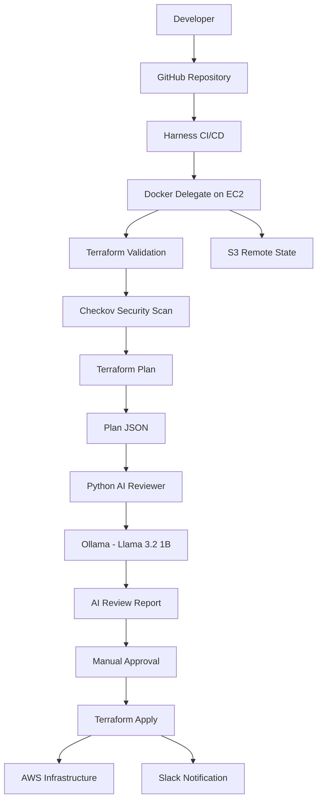

# Project Architecture

## Project

AI-Powered Infrastructure Automation using Terraform, Harness, AWS, Checkov, and Ollama.

## Architecture Diagram

```mermaid
flowchart TD
    A[Developer] --> B[GitHub Repository]
    B --> C[Harness CI/CD]
    C --> D[Docker Delegate on EC2]
    D --> E[Terraform Validation]
    E --> F[Checkov Security Scan]
    F --> G[Terraform Plan]
    G --> H[Plan JSON]
    H --> I[Python AI Reviewer]
    I --> J[Ollama - Llama 3.2 1B]
    J --> K[AI Review Report]
    K --> L[Manual Approval]
    L --> M[Terraform Apply]
    M --> N[AWS Infrastructure]
    M --> O[Slack Notification]
    D --> P[S3 Remote State]
```
